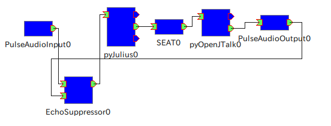

--------------------
音響フィルタの使い方
--------------------

音声認識器の認識精度は入力音声の品質に強く影響されます。音声認識の結果
は後段の対話システムの挙動にも影響を与えるため、雑音の少ない環境下では
動いていた対話システムが、別の環境では思ったように動かないこともありま
す。

ロボットは雑音環境下に置かれることが多く、一般的な音声対話システムより
も多くの考慮が必要になります。

OpenHRIでは、これら雑音の影響を低減するための音響フィルタコンポーネント
をいくつか用意しています。この章では「音響エコー除去」を例にして、それ
ら音響フィルタコンポーネントの使い方について解説します。

音響エコー除去
--------------

音響エコーとは、スピーカから出力された音声をマイクロフォンが拾ってしま
うことで発生するループのことです。音響エコーが発生すると、正確な音声認
識が難しくなります。

OpenHRIでは、音響エコーの問題を軽減するため2種類ののコンポーネントを用
意しています。それぞれ長所・短所がありますので用途に応じて使い分けてく
ださい。

エコーサプレッサ
================

音声出力コンポーネントからの出力を検出し、それと同じタイミングで音声入
力を減衰させることで、スピーカからマイクへの収音を防ぐコンポーネントで
す。以下の特徴があります。

  長所
    高速で処理できる。入力音声の変形が少ない。

  短所
    音声出力中は音声入力できないため、常に音声出力している場合などは使用が難しい。

エコーキャンセラ
================

音声出力コンポーネントからの出力信号よりエコー成分を推測して、マイクか
ら収音した信号から推測したエコー成分を除去するコンポーネントです。以下
の特徴があります。

  長所
    音声出力中でも音声入力できる。

  短所
    適応フィルタ係数を毎回更新するため処理が重い。入力音声を加工するため、
    その影響による変形が認識に悪影響を及ぼす場合がある。

使い方
------

以下に :doc:`tutorial/step4-ja` にて作成した対話システムにエコーサプレッサを接続する例を示します。

コンポーネントの接続
====================

AudioInputの出力ポートとJuliusRTCの入力ポートのリンクを削除し、以下のリンクを接続します。

    * AudioInputの出力ポートとEchoSuppressorの入力ポート「from_input」
    * AudioOutputの出力ポートとEchoSuppressorの入力ポート「from_output」
    * EchoSuppressorの出力ポートとJuliusRTCの入力ポート

リンクを作成すると、以下のスクリーンショットのようになります。

動作確認
========

All Activateボタンで全コンポーネントをアクティブ状態に遷移させます。ス
ピーカとマイクを近づけて発声し、返事が連続しないことを確認しましょう。
