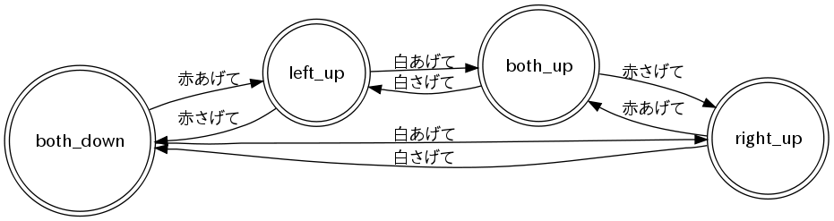

------------
旗上げゲーム
------------

「旗上げゲーム」は左右の手に持った赤と白の旗を指示に応じてあげたり下げ
たりするゲームです。

ここでは、SEATの状態遷移モデル作成の例としてとりあげます。

音声認識文法を作成する
----------------------

旗上げゲームの文法モデルを定義しましょう。旗上げゲームの入力は「赤あげ
て」「赤あげない」「赤さげて」「赤さげない」「白あげて」「白あげない」
「白さげて」「白さげない」のいずれかです。one-ofタグを使うことで各入力
を記述しても良いのですが、ここではよりコンパクトな文法を定義してみましょ
う。

flaggame-ja.grxml

.. literalinclude:: flaggame-ja.grxml
   :language: xml

上記の文法モデルは、「赤」または「白」の次に、「あげて」「あげない」
「さげて」「さげない」のいずれかが続くという文法を定義しています。

グラフ表現によって文法の構造を確認してみましょう。::

  $ srgstojulius flaggame-ja.grxml | juliustographviz | dot -Txlib

.. image:: flaggame-ja-grammar.png

対話スクリプトを作成する
------------------------

旗上げゲームでは、両手に持った旗を上げたり下げたりしますが、一度上げた
旗はもう一度上げることができません（ロボットにこれをやらせてしまうと腕
が一回転してしまいます）。

ここでは旗上げゲームを「状態遷移モデル」を使って記述してみます。

「状態遷移モデル」では、システムの「状態」を定義した上で、その状態の間
の「遷移」と「遷移条件」を記述することでシステムの振る舞いを定義します。

旗上げゲームでは、システムに以下の4つの状態があると考えられるでしょう:

    * 両方下げる
    * 左を上げる
    * 右を上げる
    * 両方上げる

旗上げゲームは両手を下げた状態で始まります。ここで、左に赤い旗、右に白
い旗を持っていたと考えると、「赤あげて」はシステムの状態を左を上げた状
態に遷移させます。

システムが左を上げた状態で「白下げて」と命令するとシステムの状態は「両
方上げる」になります。

システムが両方上げた状態で「赤あげて」と命令してもそれ以上の状態遷移は
起こりません。

SEATは状態遷移モデルをXML形式で記述することができます。上記で説明した旗
上げゲームは以下のように記述できます。

flaggame-ja.seatml	   

.. literalinclude:: flaggame-ja.seatml
   :language: xml

グラフ表現によって状態遷移モデルの構造を確認してみましょう。::

  $ seatmltographviz flaggame-ja.seatml | dot -Txlib

コンポーネントを起動し接続する
------------------------------

audioinput コンポーネント、audiooutputコンポーネント、juliusコンポーネ
ント、openjtalkコンポーネント、SEATコンポーネントをそれぞれ起動します。
  ::
  
  $ pulseaudioinput (portaudioinput)

  ::
  
  $ pulseaudioutput (portaudiooutput)

  ::

  $ juliusrtc flaggame-ja.grxml

  ::

  $ seat flaggame-ja.seatml

RT-SystemEditorを使って以下のリンクを作成してください：

    * audioinput -> julius
    * julius (result) -> SEAT
    * SEAT -> openjtalk
    * openjtalk (result) -> audiooutput

すべてのコンポーネントをアクティベートして動作を確認してください。

SEATコンポーネントを起動したコンソールを見ると、システムが現在どの状態
にいるかが表示されます。どの状態でどの遷移条件が有効になったのかを意識
しながらコマンドを発話してください。
